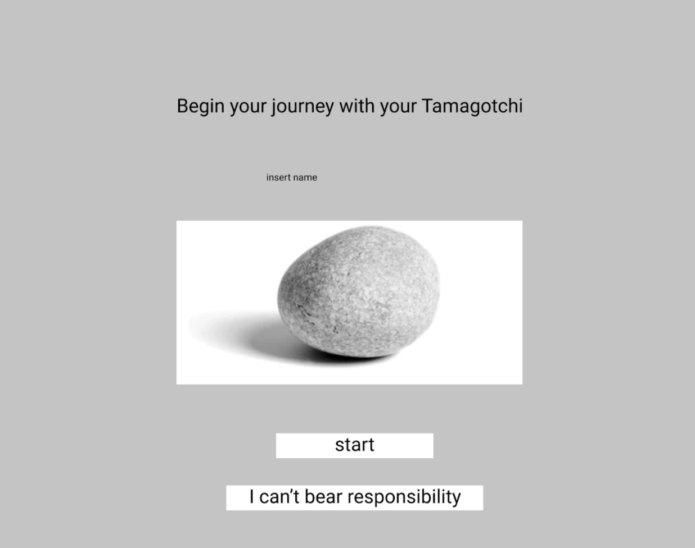
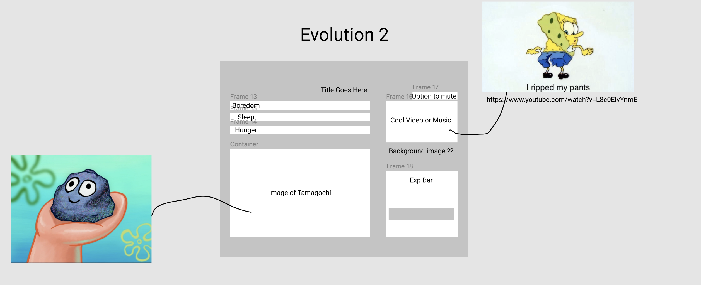

# Tamagotchi

## Concept:
The concept of the game 
Explain the concept of the application or game. Include instructions and how to win/lose.

## Wireframes:
https://www.figma.com/file/n4lw0wOCaEdHnBX8KOe3Ma/Tamagotchi?node-id=0%3A1

## Technologies Used:
    - HTML
    - CSS
    - FontAwesome
    - JavaScript

## Approach:
-First create wire
Explain your approach to develop the app/game

## Challenges:
List any challenges and how you overcame them
Indicate any outstanding problems

## Additional information:
Add anything else you would like us to know
User stories: https://docs.google.com/document/d/11mL4R1ayN5Plib07YV3qjNPADQhEyKl4nIOcrhmsbZ4/edit?usp=sharing

## App Demo
Link to GitHub project (i.e. - username.github.io)